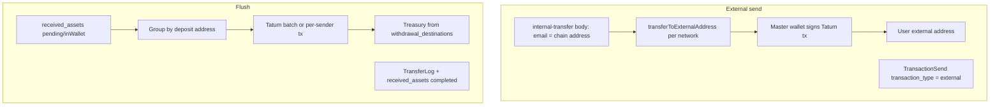

# External sending vs. flushing — full guide and source

This document explains **user external sends** (withdraw to a blockchain address) versus **flushing** (sweep `received_assets` deposits to treasury), then includes **complete PHP source** as copied from the repo at the time of writing.

---

## Table of contents

1. [Concepts at a glance](#concepts-at-a-glance)
2. [External send — behavior](#external-send--behavior)
3. [Flush — behavior](#flush--behavior)
4. [HTTP routes](#http-routes)
5. [Diagram](#diagram)
6. [Checklist](#checklist)
7. [Appendix A — `TransactionController::sendInternalTransaction`](#appendix-a--transactioncontrollersendinternaltransaction)
8. [Appendix B — `EthereumService::transferToExternalAddress`](#appendix-b--ethereumservicetransfertoexternaladdress)
9. [Appendix C — `LitecoinService::transferToExternalAddress`](#appendix-c--litecoinservicetransfertoexternaladdress)
10. [Appendix D — `BscService::transferToExternalAddress`](#appendix-d--bscservicetransfertoexternaladdress)
11. [Appendix E — `BitcoinService::transferToExternalAddress`](#appendix-e--bitcoinservicetransfertoexternaladdress)
12. [Appendix F — `SimpleWithdrawalController` (full file)](#appendix-f--simplewithdrawalcontroller-full-file)
13. [Appendix G — `config/withdrawal_destinations.php`](#appendix-g--configwithdrawal_destinationsphp)
14. [Appendix H — `SimpleWithdrawalService` (full file)](#appendix-h--simplewithdrawalservice-full-file)

---

## Concepts at a glance

| Concept | Meaning | Typical caller | Funds flow |
|--------|---------|----------------|------------|
| **External send** | User sends crypto to a **paste-your-address** destination (the `email` field is **not** a valid email, so it is treated as a chain address). | Authenticated user via `POST /api/wallet/internal-transfer` | **Master wallet** (per chain service) → user’s external address |
| **Flush** | Batch move of **`received_assets`** rows (`inWallet` / `pending`) from **deposit addresses** to **fixed treasury** addresses. | Authenticated client calling `POST /api/admin/withdrawals/flush` | Many deposit UTXOs/accounts → addresses in `withdrawal_destinations` |

They are **different**: external send is ledger + master-wallet broadcast for a **user withdrawal**. Flush is **custody consolidation** of recorded inbound deposits.

---

## External send — behavior

1. **Route:** `POST /api/wallet/internal-transfer` → `Wallet\TransactionController::sendInternalTransaction`.
2. **Detection:** `filter_var($validated['email'], FILTER_VALIDATE_EMAIL)` → if **true**, internal transfer; if **false**, **external** (the string is a blockchain address).
3. **Amount:** `fee_summary.amount_after_fee` (USD) is converted to coin with `ExchangeRate::rate_usd` via `bcdiv`.
4. **Dispatch:** `network` selects `EthereumService`, `LitecoinService`, `BscService`, or `BitcoinService` → `transferToExternalAddress(...)`.
5. **Persistence:** Creates `Transaction` + `TransactionSend` with `transaction_type` **`external`** and `tx_id` = on-chain hash.

Each `transferToExternalAddress` implementation uses the **master wallet** for that chain, builds a Tatum payload, posts to `/v3/.../transaction`, then writes `MasterWalletTransaction` and `Ledger` (and returns `txHash`, `fee`, etc. for the controller).

---

## Flush — behavior

1. **Route:** `POST /api/admin/withdrawals/flush` → `SimpleWithdrawalController::flush`.
2. **Input:** JSON body with `currency` (required), optional `limit`, optional `dry_run`. **Destination is not from the client** — it is read from `config('withdrawal_destinations')[$currency]`.
3. **Service:** `SimpleWithdrawalService::flush($currency, $destination, $limit, $dryRun)`:
   - Loads `ReceivedAsset` rows for that currency with status `inWallet` or `pending`.
   - Groups by **sender** using `groupBySender` / `senderOf` (only addresses that exist in `deposit_addresses` or resolve via `account_id` / `user_id`).
   - **BTC / LTC:** batch UTXO transaction via Tatum.
   - **TRON / USDT_TRON:** per-group sends; may TRX top-up for token gas.
   - **EVM (ETH, BSC, Polygon, tokens):** `flushAccountBased` + `endpointFor` + optional `ensureNativeGas` from master wallet.
4. **Persistence:** `TransferLog` + each flushed `ReceivedAsset` updated to `completed` with `transfered_tx`, etc.

Use **`dry_run: true`** first to receive a **`plan`** without broadcasting.

---

## HTTP routes

Registered in `routes/api.php` (prefix `/api`):

| Method | Path | Controller |
|--------|------|------------|
| `POST` | `/wallet/internal-transfer` | `Wallet\TransactionController@sendInternalTransaction` |
| `POST` | `/admin/withdrawals/flush` | `SimpleWithdrawalController@flush` |

---

## Diagram



---

## Checklist

**External send**

- [ ] Non-email `email` value = destination address.
- [ ] `ExchangeRate` exists for `currency`.
- [ ] `network` matches one of: `ethereum`, `litecoin`, `bsc`, `bitcoin`.

**Flush**

- [ ] `currency` key exists in `config/withdrawal_destinations.php`.
- [ ] Run with `dry_run: true` before production sweeps.
- [ ] `limit` optionally caps rows for staged runs.

---

## Appendix A — `TransactionController::sendInternalTransaction`

**File:** `app/Http/Controllers/Wallet/TransactionController.php`

```php
    public function sendInternalTransaction(InternalTransferRequest $request)
    {
        try {
            // Log::info("Internal Transfer request", $request->validated());

            $validated = $request->validated();
            $sendingType = filter_var($validated['email'], FILTER_VALIDATE_EMAIL) ? 'internal' : 'external';
            Log::info("Send data", $validated);
            // Log::info("Detected Sending Type: $sendingType");
                 $user = Auth::user();
            if ($sendingType == 'internal') {
                Log::info("calling internal transaction");
                $transaction = $this->transactionSendService->sendInternalTransaction(array_merge($validated, ['sending_type' => $sendingType]));
            } else {
           
                $currency = strtoupper($validated['currency']);
                $network = strtolower($validated['network']);
                $userAccount = VirtualAccount::where('user_id')->where('currency', $currency)->first();
                // $depositAddress
                $deposiAddress = DepositAddress::where('virtual_account-id', $userAccount->id)->first();

                // Convert amount_after_fee (USD) to actual currency amount using exchange rate
                $exchangeRate = ExchangeRate::where('currency', $currency)->first();
                if (!$exchangeRate) {
                    throw new \Exception("Exchange rate not found for {$currency}");
                }

                $amountToSend = bcdiv($validated['fee_summary']['amount_after_fee'], $exchangeRate->rate_usd, 8);

                if ($network === 'ethereum') {
                    $transaction = $this->EthService->transferToExternalAddress($user, $validated['email'], $amountToSend, $currency);
                }

                if ($network === 'litecoin') {
                    $transaction = $this->LitecoinService->transferToExternalAddress($user, $validated['email'], $amountToSend);
                }
                if ($network === 'bsc') {
                    $transaction = $this->BscService->transferToExternalAddress($user, $validated['email'], $amountToSend, $currency);
                }
                if ($network == 'bitcoin') {
                    $transaction = $this->BitcoinService->transferToExternalAddress($user, $validated['email'], $amountToSend);
                }

                // Log::info("Transaction created", [$transaction]);
                $senderTransaction = $this->transactionService->create([
                    'type' => 'send',
                    'amount' => $validated['amount'],
                    'currency' => $validated['currency'],
                    'status' => 'completed',
                    'network' => $validated['network'],
                    'reference' => $transaction['txHash'],
                    'user_id' => $user->id,
                    'amount_usd' => $validated['amount']
                ]);

                TransactionSend::create([
                    'transaction_type' => 'external',

                    'sender_address' =>  $deposiAddress->address ?? null,
                    'user_id' => $user->id,

                    'receiver_address' => $validated['email'],
                    'amount' => $validated['fee_summary']['amount_after_fee'],
                    'currency' => $validated['currency'],
                    'tx_id' => $transaction['txHash'],
                    'status' => 'completed',
                    'blockchain' => $validated['network'],
                    'transaction_id' => $senderTransaction->id,
                    'original_amount' => $validated['amount'],
                    'amount_after_fee' => $validated['fee_summary']['amount_after_fee'],
                    'platform_fee' => $validated['fee_summary']['platform_fee_usd'],
                    'network_fee' => $validated['fee_summary']['network_fee_usd'],
                    'fee_summary' => json_encode($validated['fee_summary']),
                    'fee_actual_transaction' => $transaction['fee']
                ]);

                // Record receiver transaction
                $transaction['refference'] = $transaction['txHash'];
                $transaction['amount'] = $validated['fee_summary']['amount_after_fee'];
                $transacton['currency'] = $validated['currency'];
                $transaction['transaction_id'] = $senderTransaction->id;
            }
        
            $this->notificationService->sendToUserById($user->id, 'Internal Transfer', 'You have received an internal transfer');


            Log::info('Transaction Sendiind datya to backend', $transaction);
            return ResponseHelper::success($transaction, 'Transaction sent successfully', 200);
        } catch (\Exception $e) {
            Log::error("Error in Internal Transfer: " . $e->getMessage());
            return ResponseHelper::error($e->getMessage(), 500);
        }
    }
```

---

## Appendix B — `EthereumService::transferToExternalAddress`

**File:** `app/Services/EthereumService.php`

```php
    public function transferToExternalAddress($user, string $toAddress, string $amount, string $currency = 'ETH', array $fee = [])
    {
        $blockchain = 'ethereum';
        $currency = strtoupper($currency);

        // 1. Decrypt master wallet
        $masterWallet = MasterWallet::where('blockchain', $blockchain)->firstOrFail();
        $fromPrivateKey = Crypt::decrypt($masterWallet->private_key);
        $fromAddress = $masterWallet->address;

        // 2. Estimate gas fee
        $gasEstimation = BlockChainHelper::estimateGasFee($fromAddress, $toAddress, $amount, $currency, 'ETH');

        $originalGasLimit = (int) ($gasEstimation['gasLimit'] ?? 21000);
        $estimatedGasPrice = (int) ($gasEstimation['gasPrice'] ?? 1000000000); // default to 1 Gwei

        // 3. Apply 70,000 gas buffer and minimum gas price logic
        $gasLimit = isset($fee['gasLimit'])
            ? (int) $fee['gasLimit']
            : $originalGasLimit + 70000;

        $gasPrice = isset($fee['gasPrice'])
            ? (int) $fee['gasPrice']
            : max($estimatedGasPrice, 1000000000); // Ensure at least 1 Gwei

        // 4. Calculate gas fee in ETH
        $requiredGasWei = bcmul((string) $gasPrice, (string) $gasLimit);
        $gasFeeEth = bcdiv($requiredGasWei, bcpow('10', '18'), 18);
        $amount = number_format((float) $amount, 4, '.', '');

        // 5. Prepare the payload for blockchain transaction
        $payload = [
            'fromPrivateKey' => $fromPrivateKey,
            'to' => $toAddress,
            'amount' => (string) $amount,
            'currency' => $currency,

        ];

        // 6. Send transaction using Tatum API
        $response = Http::withHeaders([
            'x-api-key' => config('tatum.api_key'),
        ])->post(config('tatum.base_url') . '/ethereum/transaction', $payload);

        if ($response->failed()) {
            throw new \Exception("Blockchain transaction failed: " . $response->body());
        }

        $txHash = $response->json()['txId'] ?? null;

        // 7. Log Master Wallet Transaction
        MasterWalletTransaction::create([
            'user_id' => $user->id,
            'master_wallet_id' => $masterWallet->id,
            'blockchain' => $blockchain,
            'currency' => $currency,
            'to_address' => $toAddress,
            'amount' => $amount,
            'fee' => $gasFeeEth,
            'tx_hash' => $txHash,
        ]);

        // 8. Update Ledger
        Ledger::create([
            'user_id' => $user->id,
            'type' => 'withdrawal',
            'blockchain' => $blockchain,
            'currency' => $currency,
            'amount' => $amount,
            'tx_hash' => $txHash,
        ]);

        return [
            'txHash' => $txHash,
            'sent' => $amount,
            'fee' => $gasFeeEth,
            'total' => $amount,
        ];
    }
```

---

## Appendix C — `LitecoinService::transferToExternalAddress`

**File:** `app/Services/LitecoinService.php`

```php
    public function transferToExternalAddress($user, string $toAddress, string $amount)
    {
        $masterWallet = MasterWallet::where('blockchain', $this->blockchain)->firstOrFail();
        $fromAddress = $masterWallet->address;
        $fromPrivateKey = Crypt::decrypt($masterWallet->private_key);

        $feeInfo = $this->estimateFee();
        $feeLtc = $feeInfo['feeLtc'];
        $adjustedAmount = bcsub($amount, $feeLtc, 8);

        $payload = [
            'fromAddress' => [
                [
                    'address' => $fromAddress,
                    'privateKey' => $fromPrivateKey // ✅ Move the key here!
                ]
            ],
            'to' => [
                [
                    'address' => $toAddress,
                    'value' => (float) $adjustedAmount // ✅ Must be a positive float with max 8 decimals
                ]
            ],
            'fee' => number_format((float) $feeLtc, 8, '.', ''), // ✅ convert to string with max 8 decimals

            'changeAddress' => $fromAddress // ✅ Required when fee is set manually
        ];


        $response = Http::withHeaders([
            'x-api-key' => config('tatum.api_key'),
        ])->post(config('tatum.base_url') . '/litecoin/transaction', $payload);

        if ($response->failed()) {
            throw new \Exception("LTC External Transfer Failed: " . $response->body());
        }

        $txHash = $response->json()['txId'];

        MasterWalletTransaction::create([
            'user_id' => $user->id,
            'master_wallet_id' => $masterWallet->id,
            'blockchain' => $this->blockchain,
            'currency' => 'LTC',
            'to_address' => $toAddress,
            'amount' => $adjustedAmount,
            'fee' => $feeLtc,
            'tx_hash' => $txHash,
        ]);

        Ledger::create([
            'user_id' => $user->id,
            'type' => 'withdrawal',
            'blockchain' => $this->blockchain,
            'currency' => 'LTC',
            'amount' => $adjustedAmount,
            'tx_hash' => $txHash,
        ]);

        return [
            'txHash' => $txHash,
            'sent' => $adjustedAmount,
            'fee' => $feeLtc,
            'total' => $amount,
        ];
    }
```

---

## Appendix D — `BscService::transferToExternalAddress`

**File:** `app/Services/BscService.php`

```php
    public function transferToExternalAddress($user, string $toAddress, string $amount, string $currency = 'BNB', array $fee = [])
    {
        $blockchain = 'bsc';
        $currency = strtoupper($currency);

        // 1. Decrypt master wallet
        $masterWallet = MasterWallet::where('blockchain', $blockchain)->firstOrFail();
        $fromPrivateKey = Crypt::decrypt($masterWallet->private_key);
        $fromAddress = $masterWallet->address;

        // 2. Estimate gas fee
        $gasEstimation = BlockChainHelper::estimateGasFee($fromAddress, $toAddress, $amount, $currency, 'BSC');
        $originalGasLimit = (int) ($gasEstimation['gasLimit'] ?? 21000);
        $estimatedGasPriceWei = (int) ($gasEstimation['gasPrice'] ?? 1000000000); // default 1 Gwei

        // Convert to Gwei for API
        $estimatedGasPriceGwei = (int) bcdiv((string) $estimatedGasPriceWei, bcpow('10', '9'), 0);

        // 3. Apply buffer and gas logic
        $gasLimit = isset($fee['gasLimit']) ? (int) $fee['gasLimit'] : $originalGasLimit + 70000;
        $gasPriceGwei = isset($fee['gasPrice']) ? (int) $fee['gasPrice'] : max($estimatedGasPriceGwei, 1);

        // Convert back to Wei for fee calc
        $gasPriceWei = bcmul((string) $gasPriceGwei, bcpow('10', '9'));
        $requiredGasWei = bcmul((string) $gasPriceWei, (string) $gasLimit);
        $gasFeeBnb = bcdiv($requiredGasWei, bcpow('10', '18'), 18);

        $amount = number_format((float) $amount, 4, '.', '');

        // 4. Prepare and send blockchain transaction
        $payload = [
            'fromPrivateKey' => $fromPrivateKey,
            'to' => $toAddress,
            'amount' => (string) $amount,
            'currency' => $currency,
            'fee' => [
                'gasLimit' => (string) $gasLimit,
                'gasPrice' => (string) $gasPriceGwei, // Gwei for API
            ]
        ];

        $response = Http::withHeaders([
            'x-api-key' => config('tatum.api_key'),
        ])->post(config('tatum.base_url') . '/bsc/transaction', $payload);

        if ($response->failed()) {
            throw new \Exception("Blockchain transaction failed: " . $response->body());
        }

        $txHash = $response->json()['txId'] ?? null;

        // 5. Save transaction logs
        MasterWalletTransaction::create([
            'user_id' => $user->id,
            'master_wallet_id' => $masterWallet->id,
            'blockchain' => $blockchain,
            'currency' => $currency,
            'to_address' => $toAddress,
            'amount' => $amount,
            'fee' => $gasFeeBnb,
            'tx_hash' => $txHash,
        ]);

        Ledger::create([
            'user_id' => $user->id,
            'type' => 'withdrawal',
            'blockchain' => $blockchain,
            'currency' => $currency,
            'amount' => $amount,
            'tx_hash' => $txHash,
        ]);

        return [
            'txHash' => $txHash,
            'sent' => $amount,
            'fee' => $gasFeeBnb,
            'total' => $amount,
        ];
    }
```

---

## Appendix E — `BitcoinService::transferToExternalAddress`

**File:** `app/Services/BitcoinService.php`

```php
    public function transferToExternalAddress($user, string $toAddress, string $amount)
    {
        $masterWallet = MasterWallet::where('blockchain', $this->blockchain)->firstOrFail();
        $fromAddress = $masterWallet->address;
        $fromPrivateKey = Crypt::decrypt($masterWallet->private_key);

        $feeInfo = $this->estimateFee();
        $feeBtc = $feeInfo['feeBtc'];
        $adjustedAmount = bcsub($amount, $feeBtc, 8);

        $payload = [
            'fromAddress' => [
                [
                    'address' => $fromAddress,
                    'privateKey' => $fromPrivateKey // ✅ Move the key here!
                ]
            ],
            'to' => [
                [
                    'address' => $toAddress,
                    'value' => (float) $adjustedAmount // ✅ Must be a positive float with max 8 decimals
                ]
            ],
            'fee' => number_format((float) $feeBtc, 8, '.', ''), // ✅ convert to string with max 8 decimals

            'changeAddress' => $fromAddress // ✅ Required when fee is set manually
        ];

        $response = Http::withHeaders([
            'x-api-key' => config('tatum.api_key'),
        ])->post(config('tatum.base_url') . '/bitcoin/transaction', $payload);

        if ($response->failed()) {
            throw new \Exception("BTC External Transfer Failed: " . $response->body());
        }

        $txHash = $response->json()['txId'];

        MasterWalletTransaction::create([
            'user_id' => $user->id,
            'master_wallet_id' => $masterWallet->id,
            'blockchain' => $this->blockchain,
            'currency' => 'BTC',
            'to_address' => $toAddress,
            'amount' => $adjustedAmount,
            'fee' => $feeBtc,
            'tx_hash' => $txHash,
        ]);

        Ledger::create([
            'user_id' => $user->id,
            'type' => 'withdrawal',
            'blockchain' => $this->blockchain,
            'currency' => 'BTC',
            'amount' => $adjustedAmount,
            'tx_hash' => $txHash,
        ]);

        return [
            'txHash' => $txHash,
            'sent' => $adjustedAmount,
            'fee' => $feeBtc,
            'total' => $amount,
        ];
    }
```

---

## Appendix F — `SimpleWithdrawalController` (full file)

**File:** `app/Http/Controllers/SimpleWithdrawalController.php`

```php
<?php

namespace App\Http\Controllers;

// use Illuminate\Http\Request;
use App\Services\SimpleWithdrawalService;
use Illuminate\Http\Request;
use Illuminate\Support\Facades\Validator;

class SimpleWithdrawalController extends Controller
{
    //
    /**
     * Body:
     *  - currency (string)        e.g., BTC | TRX | USDT_TRON | ETH | USDT_ETH | BNB | USDT_BSC | MATIC | USDT_POLYGON
     *  - destination (string)     recipient address
     *  - limit? (int)             cap rows processed this call
     *  - dry_run? (bool)          don't broadcast, just return plan
     */
     public function flush(Request $req, SimpleWithdrawalService $svc)
    {
        $v = Validator::make($req->all(), [
            'currency' => ['required','string','max:32'],
            'limit'    => ['nullable','integer','min:1','max:5000'],
            'dry_run'  => ['nullable','boolean'],
        ]);

        if ($v->fails()) {
            return response()->json([
                'success' => false,
                'code'    => 'VALIDATION_ERROR',
                'errors'  => $v->errors(),
            ], 422);
        }

        $data = $v->validated();
        $currency = strtoupper($data['currency']);

        // 🔒 Force destination from config
        $destinations = config('withdrawal_destinations');
        if (!isset($destinations[$currency])) {
            return response()->json([
                'success' => false,
                'message' => "No safe destination configured for {$currency}.",
            ], 400);
        }
        $destination = $destinations[$currency];

        $res = $svc->flush(
            $currency,
            $destination,
            (int)($data['limit'] ?? 0),
            (bool)($data['dry_run'] ?? false),
        );

        return response()->json($res, $res['success'] ? 200 : 500);
    }
}
```

---

## Appendix G — `config/withdrawal_destinations.php`

**File:** `config/withdrawal_destinations.php`

```php
<?php 


return [
    'BTC'        => 'bc1quz7cf4uznl2drw5gd7me24wqfpflxu5ukktmpfyzaa8snw9cj28q0aepw9',
    'ETH'        => '0x0b9BFb82322f65635d851Ef835aaeE2F8fb72111',
    'TRON'        => 'TDHLKL6aFA97rhHfqJPKkiVJh6ySVuaC1S',
    'USDT_TRON'  => 'TDHLKL6aFA97rhHfqJPKkiVJh6ySVuaC1S',
    'SOL'        => '9DVkUEJt1CiW4yDvsEkBPqzmLwp2d3jFFJaRgeR5teyF',
    'LTC'        => 'ltc1q2t55e53fx9r9lfws43wnr8mmhc9tgc095xt7dj',
    'BSC'        => '0x0b9BFb82322f65635d851Ef835aaeE2F8fb72111',
    'USDT_BSC'   => '0x0b9BFb82322f65635d851Ef835aaeE2F8fb72111',
    'USDT'   => '0x0b9BFb82322f65635d851Ef835aaeE2F8fb72111',
    'USDC'   => '0x0b9BFb82322f65635d851Ef835aaeE2F8fb72111',
];
```

> **Note:** Treasury addresses are environment-specific; update `config/withdrawal_destinations.php` for production and protect it like any sensitive deployment config.

---

## Appendix H — `SimpleWithdrawalService` (full file)

**File:** `app/Services/SimpleWithdrawalService.php`

```php
<?php
// app/Services/SimpleWithdrawalService.php

namespace App\Services;

use App\Models\DepositAddress;
use App\Models\ReceivedAsset;
use App\Models\TransferLog;
use App\Models\MasterWallet;
use App\Models\VirtualAccount;
use Illuminate\Support\Facades\Http;
use Illuminate\Support\Facades\Crypt;
use Illuminate\Support\Facades\DB;
use Illuminate\Support\Facades\Log;

class SimpleWithdrawalService
{
    // ----- Public API -----

    public function flush(string $currency, string $destination, int $limit = 0, bool $dryRun = false): array
    {
        // 1) Load candidates (simple, no reservations; keep it single-run)
        $q = ReceivedAsset::query()
            ->where('currency', $currency)
            ->whereIn('status', ['inWallet', 'pending'])
            ->orderBy('id');

        if ($limit > 0) $q->limit($limit);

        $items = $q->get();
        if ($items->isEmpty()) {
            return ['success' => true, 'message' => "No pending {$currency} items.", 'count' => 0];
        }

        // 2) Group by sender and aggregate
        $groups = $this->groupBySender($items);
        if (empty($groups)) {
            return ['success' => false, 'message' => 'No valid items found (missing sender/amount).'];
        }

        // 3) Branch by family
        try {
            if ($currency === 'BTC') {
                return $this->flushBtcBatch($groups, $items, $destination, $dryRun);
            }
            if ($currency === 'LTC') {
                return $this->flushLtcBatch($groups, $items, $destination, $dryRun);
            }
            if (in_array($currency, ['TRON', 'USDT_TRON'], true)) {
                return $this->flushTron($currency, $groups, $items, $destination, $dryRun);
            }

            return $this->flushAccountBased($currency, $groups, $items, $destination, $dryRun);
        } catch (\Throwable $e) {
            Log::error('Flush fatal', ['currency' => $currency, 'err' => $e->getMessage()]);
            return ['success' => false, 'message' => $e->getMessage()];
        }
    }

    // ----- BTC (UTXO) -----
    /**
     * Litecoin batch sweep (UTXO), same plan shape as BTC so your UI works.
     * Tatum endpoint: /v3/litecoin/transaction
     */
    private function flushLtcBatch(array $groups, $items, string $destination, bool $dryRun): array
    {
        $apiKey = $this->apiKey();
        $base   = $this->baseUrl();

        // Build inputs & sum total
        $fromAddress = [];
        $total = 0.0;

        foreach ($groups as $sender => $agg) {
            $wif = $this->decryptWifForSender($sender);
            if (!$wif) {
                Log::warning('LTC: missing/bad key for sender', ['sender' => $sender]);
                continue;
            }
            $fromAddress[] = ['address' => $sender, 'privateKey' => $wif];
            $total += (float)$agg['amount'];
        }

        if (empty($fromAddress)) {
            return ['success' => false, 'message' => 'LTC: No decryptable inputs'];
        }

        /**
         * Fee heuristic:
         *  - Litecoin fees are cheaper than BTC; still keep a safety floor.
         *  - Use a small per-input bump. Tune these to your network conditions.
         */
        $minFee = 0.00010; // floor
        $perIn  = 0.00001; // per-input bump
        $fee    = round(max($minFee, count($fromAddress) * $perIn), 8);

        $send = round($total - $fee, 8);

        // dust threshold (conservative)
        $dust = 0.00001;
        if ($send <= $dust) {
            return ['success' => false, 'message' => 'LTC: total after fee below dust'];
        }

        $payload = [
            'fromAddress'   => $fromAddress,
            'to'            => [['address' => $destination, 'value' => $send]],
            'fee'           => number_format($fee, 8, '.', ''),
            'changeAddress' => $destination,
        ];

        $plan = [
            'chain'       => 'LTC',
            'uniqSenders' => count($fromAddress),
            'rows'        => $items->count(),
            'totalIn'     => round($total, 8),
            'fee'         => round($fee,   8),
            'toSend'      => $send,
            'destination' => $destination,
            'dry_run'     => $dryRun,
        ];

        if ($dryRun) {
            return ['success' => true, 'message' => 'Dry run', 'plan' => $plan];
        }

        $resp = Http::withHeaders($this->headers($apiKey))
            ->timeout(120)->post($base . '/litecoin/transaction', $payload);

        if ($resp->failed()) {
            Log::error('LTC batch failed', ['http' => $resp->status(), 'body' => $resp->json()]);
            return ['success' => false, 'message' => 'LTC batch failed', 'tatum' => $resp->json(), 'plan' => $plan];
        }

        $body = $resp->json();
        $txId = $body['txId'] ?? null;
        if (!$txId) {
            return ['success' => false, 'message' => 'LTC: missing txId in response', 'tatum' => $body, 'plan' => $plan];
        }

        DB::transaction(function () use ($items, $destination, $txId, $body) {
            TransferLog::create([
                'from_address' => 'BATCH',
                'to_address'   => $destination,
                'amount'       => (float) array_reduce($items->all(), fn($c, $i) => $c + (float)$i->amount, 0),
                'currency'     => 'LTC',
                'tx'           => json_encode($body),
            ]);

            foreach ($items as $it) {
                $sender = $this->senderOf($it);
                if (!$sender) continue;
                $it->status            = 'completed';
                $it->transfer_address  = $sender;
                $it->transfered_tx     = $txId;
                $it->transfered_amount = (float)$it->amount;
                $it->gas_fee           = null;
                $it->address_to_send   = $destination;
                $it->save();
            }
        });

        return ['success' => true, 'message' => 'LTC batch submitted', 'txId' => $txId, 'plan' => $plan];
    }

    /**
     * BTC batch sweep (UTXO) with weight-aware fee calculation.
     *
     * @param array  $groups       sender => ['amount' => float, 'ids' => [rowIds...]]
     * @param \Illuminate\Support\Collection $items  the rows you’re flushing
     * @param string $destination  consolidation/target address (bech32)
     * @param bool   $dryRun       if true, returns plan only
     * @return array
     */
    private function flushBtcBatch(array $groups, $items, string $destination, bool $dryRun): array
    {
        $apiKey = $this->apiKey();
        $base   = $this->baseUrl();

        // === 1) Build inputs & total ===
        $fromAddress = [];
        $total = 0.0;

        foreach ($groups as $sender => $agg) {
            $wif = $this->decryptWifForSender($sender);
            if (!$wif) {
                Log::warning('BTC: missing/bad key for sender', ['sender' => $sender]);
                continue;
            }
            $fromAddress[] = ['address' => $sender, 'privateKey' => $wif];
            $total += (float) $agg['amount'];
            Log::info('BTC: adding input', ['sender' => $sender, 'amount' => $agg['amount']]);
        }

        if (empty($fromAddress)) {
            return ['success' => false, 'message' => 'BTC: No decryptable inputs'];
        }

        // === 2) Fee model (weight-aware) ===
        // Rough P2WPKH size (vbytes): 10 + 68*inputs + 31*outputs
        $inputs  = count($fromAddress);

        // MODE: sweep to ONE output by default (no change output)
        // If you want a normal payment w/ change, set $sweep = false.
        $sweep = true;

        $outputs = $sweep ? 1 : 2;

        $baseVb  = 10;
        $inVb    = 68; // ~68 vB per P2WPKH input
        $outVb   = 31; // ~31 vB per P2WPKH output

        $txVbytes = $baseVb + ($inVb * $inputs) + ($outVb * $outputs);

        // Target fee rate (sat/vB). Make configurable.
        // e.g., config/tatum.php: 'btc' => ['fee_satvb' => 12]
        $feeRateSatVb = (int) (config('tatum.btc.fee_satvb', 12));

        $feeSats = (int) ceil($txVbytes * max(1, $feeRateSatVb));
        $feeBtc  = round($feeSats / 1e8, 8);

        // Dust threshold for BTC (546 sats)
        $dustBtc = 0.00000546;

        // ---- NEW: 25% platform/tatum difference based on total input ----
        $platformCutBtc = round($total * 0.35, 8);

        // sanity: if platformCut eats everything, fail early
        if ($platformCutBtc >= round($total - $feeBtc, 8)) {
            return [
                'success' => false,
                'message' => 'BTC: 25% platform cut + fee leaves no spendable amount.',
                'plan' => [
                    'chain'       => 'BTC',
                    'inputs'      => $inputs,
                    'outputs'     => $outputs,
                    'vbytes'      => $txVbytes,
                    'fee_satvb'   => $feeRateSatVb,
                    'fee_btc'     => $feeBtc,
                    'total_in'    => round($total, 8),
                    'platform_cut' => $platformCutBtc,
                    'mode'        => $sweep ? 'sweep' : 'normal',
                    'destination' => $destination,
                ],
            ];
        }

        // === 3) Compute outputs ===
        if ($sweep) {
            // Sweep: send = total - fee - platformCut, no change output
            $send = round($total - $feeBtc - $platformCutBtc, 8);

            if ($send <= $dustBtc) {
                return [
                    'success' => false,
                    'message' => 'BTC: total after 25% cut & fee is dust (sweep). Add inputs or lower fee rate.',
                    'plan'    => [
                        'chain'        => 'BTC',
                        'inputs'       => $inputs,
                        'outputs'      => 1,
                        'vbytes'       => $txVbytes,
                        'fee_satvb'    => $feeRateSatVb,
                        'fee_btc'      => $feeBtc,
                        'platform_cut' => $platformCutBtc,
                        'total_in'     => round($total, 8),
                        'destination'  => $destination,
                        'mode'         => 'sweep',
                    ],
                ];
            }

            $payload = [
                'fromAddress'   => $fromAddress,
                'to'            => [['address' => $destination, 'value' => $send]],
                'fee'           => number_format($feeBtc, 8, '.', ''),
                // change is zero in sweep; safe to set to destination
                'changeAddress' => $destination,
            ];

            $plan = [
                'chain'        => 'BTC',
                'mode'         => 'sweep',
                'uniqSenders'  => $inputs,
                'rows'         => $items->count(),
                'totalIn'      => round($total, 8),
                'fee'          => round($feeBtc, 8),
                'platform_cut' => $platformCutBtc,
                'toSend'       => $send,
                'vbytes'       => $txVbytes,
                'fee_satvb'    => $feeRateSatVb,
                'destination'  => $destination,
                'dry_run'      => $dryRun,
            ];
        } else {
            // Normal payment: maximize send while keeping non-dust change
            // Now also subtract 25% cut from the spendable pool.
            $spendable = round($total - $feeBtc - $platformCutBtc, 8);

            $targetSend = round($spendable - $dustBtc, 8);
            if ($targetSend <= $dustBtc) {
                return [
                    'success' => false,
                    'message' => 'BTC: cannot build non-sweep tx (25% cut + fee leaves dust). Add inputs or increase total.',
                    'plan'    => [
                        'chain'        => 'BTC',
                        'mode'         => 'normal',
                        'inputs'       => $inputs,
                        'outputs'      => 2,
                        'vbytes'       => $txVbytes,
                        'fee_satvb'    => $feeRateSatVb,
                        'fee_btc'      => $feeBtc,
                        'platform_cut' => $platformCutBtc,
                        'total_in'     => round($total, 8),
                        'destination'  => $destination,
                    ],
                ];
            }

            $change = round($spendable - $targetSend, 8);

            // If change became dust, fold change into send (convert to sweep)
            if ($change <= $dustBtc) {
                $sweep   = true;
                $outputs = 1;
                $txVbytes = $baseVb + ($inVb * $inputs) + ($outVb * 1);
                $feeSats  = (int) ceil($txVbytes * max(1, $feeRateSatVb));
                $feeBtc   = round($feeSats / 1e8, 8);

                $spendable = round($total - $feeBtc - $platformCutBtc, 8);
                $targetSend = max(0, round($spendable, 8));
                $change = 0.0;
            }

            $payload = [
                'fromAddress'   => $fromAddress,
                'to'            => [['address' => $destination, 'value' => $targetSend]],
                'fee'           => number_format($feeBtc, 8, '.', ''),
                // Prefer a dedicated change address you control
                'changeAddress' => $destination,
            ];

            $plan = [
                'chain'        => 'BTC',
                'mode'         => $sweep ? 'sweep-folded' : 'normal',
                'uniqSenders'  => $inputs,
                'rows'         => $items->count(),
                'totalIn'      => round($total, 8),
                'fee'          => round($feeBtc, 8),
                'platform_cut' => $platformCutBtc,
                'toSend'       => $targetSend,
                'change'       => $change,
                'vbytes'       => $txVbytes,
                'fee_satvb'    => $feeRateSatVb,
                'destination'  => $destination,
                'dry_run'      => $dryRun,
            ];
        }


        if ($dryRun) {
            return ['success' => true, 'message' => 'Dry run', 'plan' => $plan];
        }

        // === 4) Call Tatum ===
        $resp = Http::withHeaders($this->headers($apiKey))
            ->timeout(120)
            ->post($base . '/bitcoin/transaction', $payload);

        if ($resp->failed()) {
            Log::error('BTC batch failed', ['http' => $resp->status(), 'body' => $resp->json(), 'plan' => $plan, 'payload' => $payload]);
            return ['success' => false, 'message' => 'BTC batch failed', 'tatum' => $resp->json(), 'plan' => $plan];
        }

        $body = $resp->json();
        $txId = $body['txId'] ?? null;
        if (!$txId) {
            return ['success' => false, 'message' => 'BTC: missing txId in response', 'tatum' => $body, 'plan' => $plan];
        }

        // === 5) Persist logs & mark items ===
        DB::transaction(function () use ($items, $destination, $txId, $body) {
            TransferLog::create([
                'from_address' => 'BATCH',
                'to_address'   => $destination,
                'amount'       => (float) array_reduce($items->all(), fn($c, $i) => $c + (float) $i->amount, 0),
                'currency'     => 'BTC',
                'tx'           => json_encode($body),
            ]);

            foreach ($items as $it) {
                $sender = $this->senderOf($it);
                if (!$sender) continue;
                $it->status            = 'completed';
                $it->transfer_address  = $sender;
                $it->transfered_tx     = $txId;
                $it->transfered_amount = (float) $it->amount;
                $it->gas_fee           = null;
                $it->address_to_send   = $destination;
                $it->save();
            }
        });

        return ['success' => true, 'message' => 'BTC batch submitted', 'txId' => $txId, 'plan' => $plan];
    }


    // ----- TRON (TRX / USDT_TRON) -----

    private function flushTron(string $currency, array $groups, $items, string $destination, bool $dryRun): array
    {
        $apiKey = $this->apiKey();
        $base   = $this->baseUrl();

        $isToken      = ($currency === 'USDT_TRON');
        $usdtContract = config('tatum.tron.usdt_contract', 'TR7NHqjeKQxGTCi8q8ZY4pL8otSzgjLj6t');
        $feeLimitSun  = (int)config('tatum.tron.default_fee_limit_sun', 17);
        $minTrx       = (float)config('tatum.tron.gas_topup_min_trx', 18);
        $topupTrx     = (float)config('tatum.tron.gas_topup_amount_trx', 20);

        $plan = ['chain' => 'TRON', 'currency' => $currency, 'destination' => $destination, 'groups' => [], 'dry_run' => $dryRun];
        foreach ($groups as $sender => $agg) {
            $plan['groups'][] = ['from' => $sender, 'amount' => $agg['amount'], 'rows' => count($agg['ids'])];
        }
        if ($dryRun) return ['success' => true, 'message' => 'Dry run', 'plan' => $plan];

        $ok = 0;
        $fail = 0;
        $txs = [];

        foreach ($groups as $sender => $agg) {
            $pk = $this->decryptPkForSender($sender);
            if (!$pk) {
                Log::warning('TRON: missing key', ['sender' => $sender]);
                $fail++;
                continue;
            }

            // Ensure gas if token
            if ($isToken) {
                $trxBal = $this->getTrxBalance($sender, $apiKey, $base);
                if ($trxBal < $minTrx) {
                    $topOk = $this->topUpTrx($sender, $topupTrx, $apiKey, $base);
                    if (!$topOk) {
                        $fail++;
                        continue;
                    }
                }
            }

            // Prepare payload
            if ($isToken) {
                $endpoint = '/tron/trc20/transaction';
                $payload = [
                    'fromPrivateKey' => $pk,
                    'to'             => $destination,
                    'amount'         => number_format((float)$agg['amount'], 6, '.', ''),
                    'tokenAddress'   => $usdtContract,
                    'feeLimit'       => $feeLimitSun,
                ];
            } else {
                $endpoint = '/tron/transaction';
                $payload = [
                    'fromPrivateKey' => $pk,
                    'to'             => $destination,
                    'amount'         => number_format((float)$agg['amount'], 6, '.', ''),
                    'feeLimit'       => $feeLimitSun,
                ];
            }

            $resp = Http::withHeaders($this->headers($apiKey))
                ->timeout(90)->post($base . $endpoint, $payload);

            if ($resp->failed()) {
                Log::warning('TRON send failed', ['sender' => $sender, 'http' => $resp->status(), 'body' => $resp->json()]);
                $fail++;
                continue;
            }

            $body = $resp->json();
            $txId = $body['txId'] ?? $body['txID'] ?? null;
            $txs[] = $txId;

            DB::transaction(function () use ($items, $sender, $destination, $currency, $agg, $body, $txId) {
                TransferLog::create([
                    'from_address' => $sender,
                    'to_address'   => $destination,
                    'amount'       => (float)$agg['amount'],
                    'currency'     => $currency,
                    'tx'           => json_encode($body),
                ]);

                foreach ($items as $it) {
                    if ($this->senderOf($it) !== $sender) continue;
                    $it->status            = 'completed';
                    $it->transfer_address  = $sender;
                    $it->transfered_tx     = $txId;
                    $it->transfered_amount = (float)$it->amount;
                    $it->gas_fee           = null;
                    $it->address_to_send   = $destination;
                    $it->save();
                }
            });

            $ok++;
        }

        return ['success' => $ok > 0, 'message' => "TRON flush ok={$ok} fail={$fail}", 'txIds' => $txs, 'plan' => $plan];
    }

    // ----- Account-based generic (ETH / BSC / Polygon + tokens) -----

    private function flushAccountBased(string $currency, array $groups, $items, string $destination, bool $dryRun): array
    {
        $apiKey = $this->apiKey();
        $base   = $this->baseUrl();

        $map = $this->endpointFor($currency);
        if (!$map) {
            return ['success' => false, 'message' => "Unsupported currency {$currency}"];
        }

        $plan = ['chain' => $map['chain'], 'currency' => $currency, 'destination' => $destination, 'groups' => [], 'dry_run' => $dryRun];
        foreach ($groups as $sender => $agg) {
            $plan['groups'][] = ['from' => $sender, 'amount' => $agg['amount'], 'rows' => count($agg['ids'])];
        }
        if ($dryRun) return ['success' => true, 'message' => 'Dry run', 'plan' => $plan];

        $ok = 0;
        $fail = 0;
        $txs = [];

        foreach ($groups as $sender => $agg) {
            $pk = $this->decryptPkForSender($sender);
            if (!$pk) {
                Log::warning('AB: missing key', ['sender' => $sender]);
                $fail++;
                continue;
            }

            // ensure gas on sender for native/tokens
            $this->ensureNativeGas($map['chain'], $sender, $apiKey, $base);
            $amount=(float)$agg['amount'];
            //cut down the amount by 0.35%
            // $amount=$amount;
            $payload = [
                'fromPrivateKey' => $pk,
                'to'             => $destination,
                'amount'         => number_format($amount, 8, '.', ''),
            ];

            if (!empty($map['needsCurrency']) && !empty($map['currencyValue'])) {
                $payload['currency'] = $map['currencyValue']; // ETH / BSC / MATIC
            }
            if (!empty($map['contractAddress'])) {
                $payload['contractAddress'] = $map['contractAddress']; // exact name for Tatum
            }

            $resp = Http::withHeaders($this->headers($apiKey))
                ->timeout(90)->post($base . $map['endpoint'], $payload);

            if ($resp->failed()) {
                Log::warning('AB send failed', ['sender' => $sender, 'http' => $resp->status(), 'body' => $resp->json(), 'payload' => $payload]);
                $fail++;
                continue;
            }

            $body = $resp->json();
            $txId = $body['txId'] ?? $body['hash'] ?? null;
            $txs[] = $txId;

            DB::transaction(function () use ($items, $sender, $destination, $currency, $agg, $body, $txId) {
                TransferLog::create([
                    'from_address' => $sender,
                    'to_address'   => $destination,
                    'amount'       => (float)$agg['amount'],
                    'currency'     => $currency,
                    'tx'           => json_encode($body),
                ]);

                foreach ($items as $it) {
                    if ($this->senderOf($it) !== $sender) continue;
                    $it->status            = 'completed';
                    $it->transfer_address  = $sender;
                    $it->transfered_tx     = $txId;
                    $it->transfered_amount = (float)$it->amount;
                    $it->gas_fee           = null;
                    $it->address_to_send   = $destination;
                    $it->save();
                }
            });

            $ok++;
        }

        return ['success' => $ok > 0, 'message' => "Account flush ok={$ok} fail={$fail}", 'txIds' => $txs, 'plan' => $plan];
    }


    // ----- Small helpers -----

    private function groupBySender($items): array
    {
        $groups = [];
        foreach ($items as $it) {
            $sender = $this->senderOf($it);
            $amt    = (float) $it->amount;

            if (!$sender || $amt <= 0) {
                Log::info("skipping row and bad sender/amount", [
                    'row_id' => $it->id,
                    'sender_candidate' => [$it->transfer_address, $it->deposit_address, $it->address, $it->to_address, $it->from_address],
                    'amount' => $it->amount,
                ]);            // Log::channel('withdrawals')->warning('Skipping row: bad sender/amount', );
                continue;
            }
            if (!isset($groups[$sender])) $groups[$sender] = ['amount' => 0.0, 'ids' => []];
            $groups[$sender]['amount'] += $amt;
            $groups[$sender]['ids'][]   = $it->id;
        }
        return $groups;
    }


    private function senderOf($it): ?string
    {
        // Try the most common columns that may contain the address we control
        $rawCandidates = [
            $it->transfer_address ?? null,
            $it->deposit_address ?? null,
            $it->address ?? null,
            $it->to_address ?? null,     // funds received "to" our deposit address (very common)
            $it->from_address ?? null,   // fallback if your schema uses from_address as our own
        ];
        $candidates = array_values(array_unique(array_filter(array_map(function ($v) {
            if (!is_string($v)) return null;
            $v = trim($v);
            return strlen($v) > 20 ? $v : null;
        }, $rawCandidates))));

        foreach ($candidates as $maybe) {
            // Return canonical DB address to avoid later case/format mismatch.
            $dep = DepositAddress::whereRaw('LOWER(address) = ?', [strtolower($maybe)])->first();
            if ($dep) {
                return $dep->address; // only accept addresses we actually control
            }
        }

        // Fallback: resolve sender from account_id -> virtual_account -> deposit_address
        // This handles rows where webhook payload didn't include a directly matchable address.
        if (!empty($it->account_id)) {
            $va = VirtualAccount::where('account_id', $it->account_id)->first();
            if ($va) {
                $dep = DepositAddress::where('virtual_account_id', $va->id)->orderByDesc('id')->first();
                if (!empty($dep?->address)) {
                    return $dep->address;
                }
            }
        }

        // Fallback: resolve sender from user_id (+ chain hint from currency).
        if (!empty($it->user_id)) {
            $chainHints = $this->chainHintsForCurrency($it->currency ?? null);
            $depQuery = DepositAddress::whereHas('virtualAccount', function ($q) use ($it) {
                $q->where('user_id', $it->user_id);
            });
            if (!empty($chainHints)) {
                $depQuery->whereIn('blockchain', $chainHints);
            }
            $dep = $depQuery->orderByDesc('id')->first();
            if (!empty($dep?->address)) {
                return $dep->address;
            }
        }

        return null;
    }

    private function chainHintsForCurrency(?string $currency): array
    {
        $c = strtoupper((string) $currency);
        return match ($c) {
            'ETH', 'USDT', 'USDC', 'USDT_ETH', 'USDC_ETH' => ['eth', 'usdt', 'usdc'],
            'BNB', 'BSC', 'USDT_BSC', 'USDC_BSC' => ['bsc', 'usdt_bsc', 'usdc_bsc'],
            'TRON', 'USDT_TRON' => ['tron', 'usdt_tron'],
            'MATIC', 'POLYGON', 'USDT_POLYGON', 'USDC_POLYGON' => ['polygon', 'matic', 'usdt_polygon', 'usdc_polygon'],
            'BTC' => ['bitcoin', 'btc'],
            'LTC' => ['litecoin', 'ltc'],
            default => [],
        };
    }


    private function decryptWifForSender(string $sender): ?string
    {
        $dep = DepositAddress::where('address', $sender)->first();
        if (!$dep) return null;
        try {
            $wif = Crypt::decryptString($dep->private_key);
            return (is_string($wif) && strlen($wif) >= 50) ? $wif : null;
        } catch (\Throwable $e) {
            return null;
        }
    }

    private function decryptPkForSender(string $sender): ?string
    {
        $dep = DepositAddress::where('address', $sender)->first();
        if (!$dep) return null;
        try {
            $pk = Crypt::decryptString($dep->private_key);
            return (is_string($pk) && strlen($pk) >= 32) ? $pk : null;
        } catch (\Throwable $e) {
            return null;
        }
    }

    private function endpointFor(string $currency): ?array
    {
        $c = strtoupper($currency);

        return match ($c) {
            // ===== ETH native =====
            'ETH' => [
                'chain'         => 'ETH',
                'endpoint'      => '/ethereum/transaction',
                'needsCurrency' => true,
                'currencyValue' => 'ETH',
            ],

            // ===== ETH tokens (ERC-20) =====
            'USDT', 'USDT_ETH' => [
                'chain'           => 'ETH',
                'endpoint'        => '/ethereum/transaction',
                'needsCurrency'   => true,
                'contractAddress' => '0xdAC17F958D2ee523a2206206994597C13D831ec7', // USDT ERC-20
                'currencyValue' => 'USDT',
            ],
            'USDC', 'USDC_ETH' => [
                'chain'           => 'ETH',
                'endpoint'        => '/ethereum/transaction',
                'needsCurrency'   => true,

                'currencyValue' => 'USDC',
                'contractAddress' => '0xA0b86991c6218b36c1d19D4a2e9Eb0cE3606eB48', // USDC ERC-20
            ],

            // ===== BSC native (BNB) =====
            'BNB', 'BSC' => [
                'chain'         => 'BSC',
                'endpoint'      => '/bsc/transaction',
                'needsCurrency' => true,
                'currencyValue' => 'BSC',
            ],

            // ===== BSC tokens (BEP-20) =====
            'USDT_BSC' => [
                'chain'           => 'BSC',
                'endpoint'        => '/bsc/transaction',
                'needsCurrency'   => true,
                'contractAddress' => '0x55d398326f99059fF775485246999027B3197955', // USDT BEP-20
                'currencyValue'   => 'USDT_BSC',
            ],
            'USDC_BSC' => [
                'chain'           => 'BSC',
                'endpoint'        => '/bsc/transaction',
                'needsCurrency'   => true,
                'contractAddress' => '0x64544969ed7EBf5f083679233325356EbE738930', // USDC BEP-20
                'currencyValue'   => 'USDC_BSC',
            ],

            // ===== Polygon native (MATIC) =====
            'MATIC', 'POLYGON' => [
                'chain'         => 'POLYGON',
                'endpoint'      => '/polygon/transaction',
                'needsCurrency' => true,
                'currencyValue' => 'MATIC',
            ],

            // ===== Polygon tokens (ERC-20 on Polygon) =====
            'USDT_POLYGON' => [
                'chain'           => 'POLYGON',
                'endpoint'        => '/polygon/erc20/transaction',
                'needsCurrency'   => false,
                'contractAddress' => '0xc2132D05D31c914a87C6611C10748AaCB9fC6fC', // USDT on Polygon
            ],
            'USDC_POLYGON' => [
                'chain'           => 'POLYGON',
                'endpoint'        => '/polygon/erc20/transaction',
                'needsCurrency'   => false,
                'contractAddress' => '0x2791Bca1f2de4661ED88A30C99A7a9449Aa84174', // USDC.e on Polygon
            ],

            default => null,
        };
    }


    private function ensureNativeGas(string $chain, string $sender, string $apiKey, string $base): void
    {
        [$endpoint, $min] = match ($chain) {
            'ETH'     => ['/ethereum/account/balance/', 0.002],
            'BSC'     => ['/bsc/account/balance/',      0.010],
            'POLYGON' => ['/polygon/account/balance/',  1.000],
            default   => [null, 0],
        };
        if (!$endpoint) return;
        Log::info('Checking native gas balance for ' . $chain);
        $res = Http::withHeaders(['x-api-key' => $apiKey])->get($base . $endpoint . $sender);
        $bal = $res->ok() ? (float)($res->json('balance') ?? 0) : 0.0;
        if ($bal >= $min) return;

        $mwKey = match ($chain) {
            'ETH' => 'ETHEREUM',
            'BSC' => 'BSC',
            'POLYGON' => 'POLYGON',
            default => null,
        };
        if (!$mwKey) return;

        $mw = MasterWallet::where('blockchain', $mwKey)->first();
        if (!$mw) return;

        $pk = Crypt::decrypt($mw->private_key);
        $top = $min * 1.2;

        $txEndpoint = match ($chain) {
            'ETH'     => '/ethereum/transaction',
            'BSC'     => '/bsc/transaction',
            'POLYGON' => '/polygon/transaction',
            default   => null,
        };
        if (!$txEndpoint) return;

        $payload = [
            'fromPrivateKey' => $pk,
            'to'             => $sender,
            'amount'         => (string)$top,
            'currency'       => match ($chain) {
                'ETH'     => 'ETH',
                'BSC'     => 'BSC',
                'POLYGON' => 'MATIC',
                default   => null,
            },
        ];

        $resp = Http::withHeaders($this->headers($apiKey))
            ->timeout(90)->post($base . $txEndpoint, $payload);
        Log::info('Gas top-up', ['chain' => $chain, 'sender' => $sender, 'resp' => $resp->json()]);
        if ($resp->failed()) {
            Log::warning('Gas top-up failed', ['chain' => $chain, 'sender' => $sender, 'resp' => $resp->json()]);
        }
    }


    private function getTrxBalance(string $address, string $apiKey, string $base): float
    {
        $res = Http::withHeaders(['x-api-key' => $apiKey])->get($base . "/tron/account/{$address}");
        if ($res->failed()) return 0.0;
        $sun = (int)($res->json('balance') ?? 0);
        return $sun / 1e6;
    }

    private function topUpTrx(string $to, float $amount, string $apiKey, string $base): bool
    {
        $mw = MasterWallet::where('blockchain', 'TRON')->first();
        if (!$mw) {
            Log::warning('TRON master wallet missing');
            return false;
        }
        $pk = Crypt::decrypt($mw->private_key);

        $payload = [
            'fromPrivateKey' => $pk,
            'to'             => $to,
            'amount'         => number_format($amount, 6, '.', ''),
        ];

        $resp = Http::withHeaders($this->headers($apiKey))
            ->timeout(90)->post($base . '/tron/transaction', $payload);

        if ($resp->failed()) {
            Log::warning('TRON top-up failed', ['to' => $to, 'body' => $resp->json()]);
            return false;
        }
        return true;
    }

    // ----- tiny utils -----

    private function apiKey(): string
    {
        $k = config('tatum.api_key', env('TATUM_API_KEY'));
        if (!$k) throw new \RuntimeException('Tatum API key missing');
        return $k;
    }

    private function baseUrl(): string
    {
        return rtrim(config('tatum.base_url', env('TATUM_BASE_URL', 'https://api.tatum.io/v3')), '/');
    }

    private function headers(string $apiKey): array
    {
        return [
            'x-api-key'    => $apiKey,
            'accept'       => 'application/json',
            'content-type' => 'application/json',
        ];
    }
}
```

---

## Maintenance note

This appendix is a **copy of the PHP sources** for offline reading. When code changes, regenerate or diff against:

- `app/Http/Controllers/Wallet/TransactionController.php`
- `app/Services/EthereumService.php`, `LitecoinService.php`, `BscService.php`, `BitcoinService.php`
- `app/Http/Controllers/SimpleWithdrawalController.php`
- `app/Services/SimpleWithdrawalService.php`
- `config/withdrawal_destinations.php`
